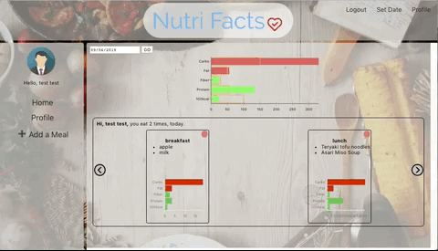

# Nutri Facts
**[Live App](https://nutri-facts.herokuapp.com/)**

Nutri Facts is a diet tracker with food suggestions and nutrient status visualization. It help you track your overall intake versus the nutrient goal for the users. It also recommend meal for users when they have no idea what to eat based on their criteria.

**Tech:** Javascript, React, Node/Express, JWT, NoSQL/MongoDB, Edamam API, react-vis

This is a group project with *[Reid Miller](https://github.com/rmiller999)*, *[River Droz](https://github.com/rivedroz23)* and *[Joseph Beech](https://github.com/Mothergoose31)*

## Table of Contents
* [Preview](#Preview)
* [Design](#Design)
* [Development](#Development)
* [References](#References)

## Preview

| Login with JWT<br> See your Intake Stats | Meal Recommendation by your choice |
|:---:|:---:|
| |  |

| Add a Meal | Remove a Meal
|:---:|:---:|
| | 

## Design
To realize the functions of Nutri Facts as described above, following features are designed:

### Features
* Meal/Food info: visualize the nutrient data for meal and food based user's input.
* Meal record: save content and nutrient data of user meals in database.
* Track overall nutrient: visualize user's overall intake versus user's diet goal.

## Development
The dish recommendation and nutrition data are obtained from Nutirtion Analysis and Meal Recommendation Engine with the client ID and client secrect. For detailed info and instruction, please refer to [edamam developer website](https://developer.edamam.com).

**Data Visualization (react-vis)**

Nutrition data, user's goal and nutrient stats visualization is implemented by [React-Vis](https://uber.github.io/react-vis/) after data comes back from api and is reshaped.
```javascript
import React from 'react';
// flexible width plot is chosen for responsibility of website
import {FlexibleWidthXYPlot,
        HorizontalBarSeries,
        XAxis,
        YAxis,
        DiscreteColorLegend,
        } from 'react-vis';

const FoodsNutriIndicator = props => {
  // key name for data come back from api
  const nutrientsKeys = ['ENERC_KCAL', 'PROCNT', 'FIBTG', 'FAT', 'CHOCDF']
  let foods = props.foods.food;
  let max = 0;
  console.log(foods);

  // initial data for xy plot with react-vis
  let mealsData = [
    {y: '100kcal', x: 0},
    {y: 'Protain', x: 0},
    {y: 'Fiber', x: 0},
    {y: 'Fat', x: 0},
    {y: 'Carbs', x: 0}
  ]; 

  // update the mealsData with data from api
  if (foods.length > 0) {
    foods.forEach(function(food) {
      for (let key in food.nutrients) {
        let value = food.nutrients[key]
        key === 'ENERC_KCAL' ? value = value/100 : value=value;
        console.log(key, value);
        mealsData[nutrientsKeys.indexOf(key)].x += value;
      }
    })
  }
  console.log(mealsData);

  return (
    //plot 
    <div className='foods-nutri-indicator'>
      <FlexibleWidthXYPlot height={150} margin={{left: 50}} yType="ordinal">
        <HorizontalBarSeries data={mealsData.slice(0,-2)}  color="#59b953" cluster='meal'/>
        <HorizontalBarSeries data={mealsData.slice(-2)}  color='red' cluster='meal'/>
        <YAxis tickPadding={0.5} />
        <XAxis />
      </FlexibleWidthXYPlot>
    </div>
  );
}

export default FoodsNutriIndicator;

``` 

**Restful Route**

| Routes | Methods | Notes |
|:------:|:-------:|:-----:|
| /api/users/:id | GET | get nutri goals |
| /api/users/:uid/meals | POST | add a meal to user |
| /api/users/:id/meals | GET | get meals info for user |
| /api/meals/:id | GET | get nutri info for a meal |
| /api/meals/:id | DELETE | remove a meal from user |
| /api/foodsearch | POST | call edamam api for nutri data of food input by user |
| /api/dishsearch | POST | call edamam api to search dish based on user's criteria |


## Reference
* **[Edamam API](https://www.edamam.com)**: for food nutrients data and meal recommendation.
* **[React-Vis](https://uber.github.io/react-vis/)**: for data visualization.
* **[Stack Overflow](https://stackoverflow.com/)**: for quesionts and errors.
* **[W3School](https://www.w3schools.com/)**: for CSS, HTML and Javascript documents.